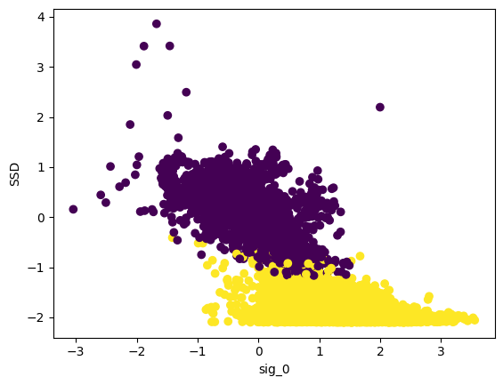
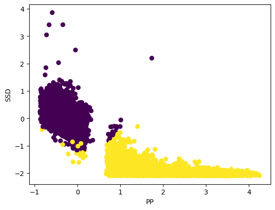
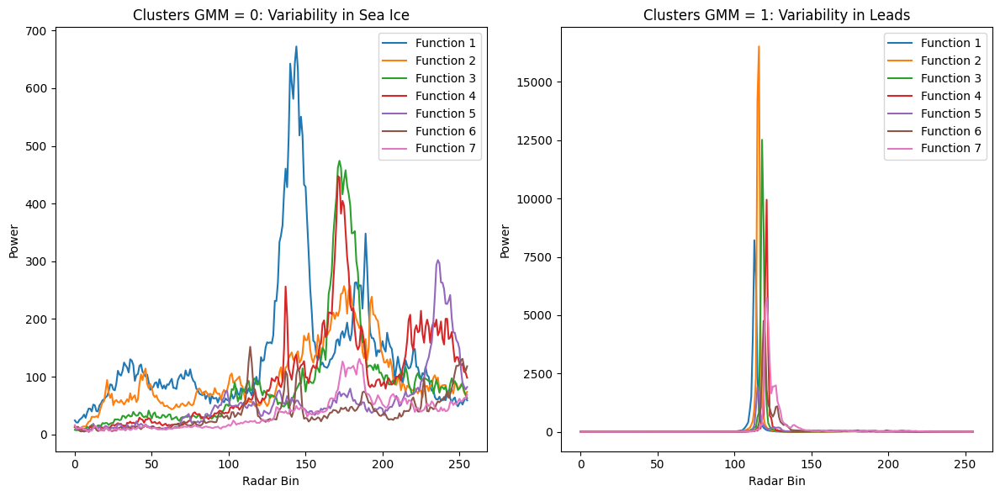
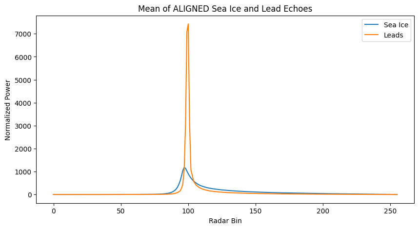
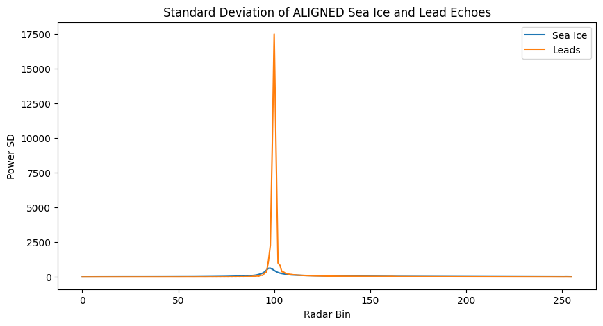
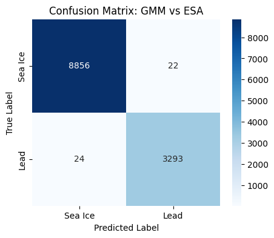

# AI4EO-GEOL0069 Week 4 Assignment 

## Assignment Overview

The objective of this assignment is to classify altimetry echoes into two surface types (sea ice and leads) using a chosen unsupervised learning method (GMM) applied to Sentinel-3 altimetry data. We will process waveform echoes to distinguish between these two classes and compute the average echo shape and standard deviation for each class in order to characterise their statistical and physical differences. Finally we will quantify our echo classifications against the ESA official classification using a confusion matrix.
The classification workflow will build upon the provided notebook Chapter1_Unsupervised_Learning_Methods.ipynb.

## Installations

* Mounting Google Drive on Google Colab
  ```sh
  from google.colab import drive
  drive.mount('/content/drive')
  ```
* Required Python packages installed for this assignment:
* Using pip install:
  ```sh
  !pip install rasterio
  ```
  Reading and handling raster data
  ```sh
  !pip install netCDF4
  ```
  Reading Sentinel-3 altimetry files in NetCDF format
  ```sh
  !pip install msalign
  ```
  Pre-processing and aligning waveform echoes.
  ```sh
  !pip install scikit-learn (GaussianMixture, confusion_matrix, classification_report)
  ```
  Provides GMM for unsupervised classification and evaluation metrics
  
* Required Python packages usually pre-installed for this assignment:
  ```sh
  numpy
  ```
  Array operations and numerical computations
  ```sh
  matplotlib.pyplot
  ```
  Plotting echoes and visualizing results
  ```sh
  scipy.interpolate.interp1d
  ```
  Interpolating waveform echoes for alignment and averaging

  ## Context

Distinguishing sea ice from leads is important for several reasons: monitoring changes in polar ice coverage for climate research, improving navigation safety in polar regions, and supporting environmental and ecological studies. Understanding where open water occurs within sea ice helps scientists track melting, energy exchange between the ocean and atmosphere, and habitat availability for marine life.

Altimetry satellites, such as Sentinel-3, send radar signals toward the Earth's surface and record the reflected signals, known as echoes. These echoes carry detailed information about surface properties: differences in material, roughness, and elevation alter the shape and strength of the returned signal, making it possible to distinguish between surfaces like sea ice and leads.

By analysing these echoes with unsupervised learning methods like the Gaussian Mixture Model (GMM), we can classify surface types, compute their average echo shapes and standard deviations, and compare the results to ESA official classifications. This provides a robust method for monitoring polar environments using satellite altimetry.

Below are links to European Space Agency (ESA) pages on Copernicus and Sentinel-3, as well as further information on the importance of understanding sea ice leads
* Copernicus - (https://www.esa.int/Applications/Observing_the_Earth/Copernicus/Introducing_Copernicus)
* Sentinel-3 - (https://www.esa.int/Applications/Observing_the_Earth/Copernicus/Sentinel-3/Introducing_Sentinel-3)
* Sea ice Leads - (https://www.dkrz.de/en/communication/galerie/Vis/icesheet/sea-ice-leads)
 
 ## Introduction to Unsupervised Learning

Unsupervised learning methods are used when labels are not available in the dataset. Instead of relying on pre-defined categories, these algorithms identify patterns or groupings based on the inherent structure of the data. In this assignment, we apply the Gaussian Mixture Model (GMM), which clusters the altimetry echoes based on the distribution of selected features.

<p align="center">
  
</p>

## Gaussian Mixture Modeling (GMM) of Altimetry Echoes

The Gaussian Mixture Model (GMM) is an unsupervised learning algorithm used to identify clusters in data when labels are not available. Unlike K-Means, which assigns points to the nearest cluster center, GMM assumes that each cluster follows a Gaussian (normal) distribution. Each data point has a probabilistic membership in every cluster, which allows GMM to model overlapping clusters and clusters of different shapes and sizes.
In this assignment, GMM is applied to altimetry echoes to classify sea ice and leads based on features derived from the waveform.

### Why GMM?
* Flexible: Can handle clusters with different shapes, sizes, and orientations.
* Probabilistic: Provides the likelihood that a point belongs to each cluster.
* More appropriate than K-Means for altimetry echoes, where clusters are not perfectly spherical.
* Other unsupervised alternatives could include DBSCAN or hierarchical clustering, but GMM offers the best trade-off between interpretability and performance for this dataset.

### GMM Basic Code
```sh
 from sklearn.mixture import GaussianMixture
import matplotlib.pyplot as plt
import numpy as np

# Sample data
X = np.random.rand(100, 2)

# GMM model
gmm = GaussianMixture(n_components=3)
gmm.fit(X)
y_gmm = gmm.predict(X)

# Plotting
plt.scatter(X[:, 0], X[:, 1], c=y_gmm, cmap='viridis')
centers = gmm.means_
plt.scatter(centers[:, 0], centers[:, 1], c='black', s=200, alpha=0.5)
plt.title('Gaussian Mixture Model')
plt.show()
```
<p align="center">
  
</p>

This visualization shows the results of a Gaussian Mixture Model (GMM) applied to a 2D dataset. Each colored cluster represents a Gaussian component identified by the model, where points are grouped based on probabilistic membership rather than hard boundaries. The larger grey markers indicate the estimated cluster means, highlighting the center of each Gaussian distribution.

#### Features Used for Clustering
The clustering model uses waveform-derived features that capture surface reflectivity, roughness, and signal variability:

- `sig_0` — Normalized backscatter amplitude (indicative of surface reflectivity)
- `PP` — Peakiness of the waveform (reflecting surface roughness)
- `SSD` — Stack standard deviation (representing variability across repeated echoes)

To evaluate and interpret the Gaussian Mixture Model (GMM) clustering results, scatter plots were generated for each pair of input features (`sig_0` vs `PP`, `sig_0` vs `SSD`, and `PP` vs `SSD`). Plotting feature pairs allows us to visually assess how well the clusters are separated in feature space and to understand which variables contribute most to distinguishing surface types.

<p align="center">
  
</p>

<p align="center">
  
</p>

<p align="center">
  
</p>

These plots show that the purple cluster forms a distinct grouping, clearly separated from the yellow cluster across all feature combinations. This separation indicates that the GMM has successfully identified statistically and physically different surface scattering behaviours. The distinct cluster suggests differences in surface reflectivity (`sig_0`), roughness (`PP`), and signal variability (`SSD`), implying that the model is capturing meaningful variation rather than arbitrary groupings.

## Echo Classification: Leads vs Sea Ice

This section classifies radar echoes into leads (open water) and sea ice, then evaluates the classification by comparing it with the ESA official dataset. The analysis also computes the average waveform shape and standard deviation for each class to characterize their physical differences.

### Classification code
#### 1. Load Echo Data
The first step is loading the SAR echo data from the provided file path. The data is stored in a NetCDF file.
```sh
path = '/content/drive/MyDrive/Week 4/'
SAR_file = 'S3A_SR_2_LAN_SI_20190307T005808_20190307T012503_20230527T225016_1614_042_131______LN3_R_NT_005.SEN3'
SAR_data = Dataset(path + SAR_file + '/enhanced_measurement.nc')
```

#### 2. Model Setup and Fitting
The echoes are first classified into two categories (leads and sea ice - n_component=2) using a Gaussian Mixture Model (GMM).
```sh
gmm = GaussianMixture(n_components=2, random_state=0)
gmm.fit(data_cleaned)
```
####  3. Cluster Prediction
Each echo is then assigned to a cluster (0 or 1) based on the GMM’s learned distributions.
```sh
clusters_gmm = gmm.predict(data_cleaned)
```
#### 4. Cluster Summary
The number of echoes in each cluster is counted to summarise the classification results.
```sh
unique, counts = np.unique(clusters_gmm, return_counts=True)
class_counts = dict(zip(unique, counts))
print("Cluster counts:", class_counts)
```
#### Example output: {0: 8880, 1: 3315}
Note: Cluster 0 contains 8,880 echoes and cluster 1 contains 3,315 echoes. These clusters represent the two categories of echoes, which will be interpreted as leads or sea ice in further analysis.

## Echo Waveform Analysis: Raw, Mean, and Standard Deviation
In this section, we analyse the shape and variability of the echoes. This helps us understand how the echoes from leads and sea ice differ, both in their overall waveform and in the variability between individual echoes.

### Raw Waveform Plots
The raw waveform plots show the first 7 echo waveforms from each cluster (0 for sea ice or 1 for leads). This visualisation allows us to compare the variability and shape of the echoes within each category before any statistical summarisation. Plotting multiple echoes together highlights differences in timing, amplitude, and overall structure.
```sh
import matplotlib.pyplot as plt

# Create subplots with 1 row and 2 columns
fig, axs = plt.subplots(1, 2, figsize=(12, 6))

# Plot first 7 functions where clusters_gmm is equal to 0
functions_to_plot_0 = waves_cleaned[clusters_gmm == 0][:7]
for i, function in enumerate(functions_to_plot_0):
    axs[0].plot(function, label=f'Function {i+1}')

# Plot first 7 functions where clusters_gmm is equal to 1
functions_to_plot_1 = waves_cleaned[clusters_gmm == 1][:7]
for i, function in enumerate(functions_to_plot_1):
    axs[1].plot(function, label=f'Function {i+1}')

# Set titles
axs[0].set_title('Clusters GMM = 0: Variability in Sea Ice')
axs[1].set_title('Clusters GMM = 1: Variability in Leads')

# Set axis labels
for ax in axs:
    ax.set_xlabel('Radar Bin')
    ax.set_ylabel('Power')

# Add legends
axs[0].legend()
axs[1].legend()

# Adjust layout and show
plt.tight_layout()
plt.show()
```
<p align="center">
  
</p>

### Results:
#### Cluster 0 (Sea Ice):
* The waveforms are highly variable and chaotic.
* Peaks occur at different points across the time axis.
* There is substantial variation between individual echoes, indicating that sea ice
* echoes are less consistent in shape.
#### Cluster 1 (Leads):
* The waveforms are more orderly and consistent.
* Peaks tend to occur at the same point across all echoes.
* Some variation in peak height remains, but the overall structure is much more uniform compared to sea ice, reflecting the more coherent nature of lead echoes.

### Interpretation:
The raw waveform comparison demonstrates that sea ice echoes are more chaotic, while lead echoes show more regularity, which aligns with the physical differences in surface structure between sea ice and open water.

### Mean and standard deviation
After examining the raw waveforms, the mean and standard deviation is calculated for each cluster. This allows for the general shape of the echoes to be summarised and the variability within each category to be quantified.
```sh
import matplotlib.pyplot as plt
import numpy as np

# Compute mean and standard deviation for Sea Ice and Leads
mean_ice = np.mean(waves_cleaned[clusters_gmm==0], axis=0)
std_ice = np.std(waves_cleaned[clusters_gmm==0], axis=0)

mean_lead = np.mean(waves_cleaned[clusters_gmm==1], axis=0)
std_lead = np.std(waves_cleaned[clusters_gmm==1], axis=0)

# --- Plot Means ---
plt.figure(figsize=(10,5))
plt.plot(mean_ice, label='Sea Ice', color='blue')
plt.plot(mean_lead, label='Lead', color='orange')
plt.title('Mean Echoes for Sea Ice and Lead')
plt.xlabel('Radar Bin')
plt.ylabel('Power')
plt.legend()
plt.tight_layout()
plt.show()

# --- Plot Standard Deviations ---
plt.figure(figsize=(10,5))
plt.plot(std_ice, label='Sea Ice', color='blue')
plt.plot(std_lead, label='Lead', color='orange')
plt.title('Standard Deviation of Echoes for Sea Ice and Lead')
plt.xlabel('Radar Bin')
plt.ylabel('Power')
plt.legend()
plt.tight_layout()
plt.show()
```
<p align="center">
  
</p>

<p align="center">
  
</p>

### Interpretation:
The higher mean peaks for leads indicate stronger echoes from open water, while the smooth peaks of sea ice reflect weaker, more diffused echoes. The spiked standard deviation for leads shows that although the peak occurs consistently, there is still variation in echo strength, likely due to small surface disturbances. Sea ice, on the other hand, produces more consistent, low-intensity echoes, resulting in a smoother standard deviation.

### Aligned waveforms
To compare echoes more accurately, the waveforms are aligned based on a reference point (e.g., the first significant peak). Alignment removes timing variability, allowing clearer comparison of shape and variability between echoes in each cluster.
```sh
!pip install msalign
from msalign import msalign
import matplotlib.pyplot as plt
import numpy as np

# --- Set up range and reference bin for alignment ---
r = np.arange(waves_cleaned.shape[1])  # 0 to 255 for 256 bins
reference = [100]  # align all waveforms to bin 100

# --- Align waveforms ---
aligned_sea_ice = msalign(r, waves_cleaned[clusters_gmm==0].T, reference)
aligned_leads    = msalign(r, waves_cleaned[clusters_gmm==1].T, reference)

# --- Plot mean of aligned waveforms ---
plt.figure(figsize=(10,5))
plt.plot(np.mean(aligned_sea_ice, axis=0), label='Sea Ice')
plt.plot(np.mean(aligned_leads, axis=0), label='Leads')
plt.title('Mean of ALIGNED Sea Ice and Lead Echoes')
plt.xlabel('Radar Bin')
plt.ylabel('Normalized Power')
plt.legend()
plt.show()

# --- Plot standard deviation of aligned waveforms ---
plt.figure(figsize=(10,5))
plt.plot(np.std(aligned_sea_ice, axis=0), label='Sea Ice')
plt.plot(np.std(aligned_leads, axis=0), label='Leads')
plt.title('Standard Deviation of ALIGNED Sea Ice and Lead Echoes')
plt.xlabel('Radar Bin')
plt.ylabel('Power SD')
plt.legend()
plt.show()
```
<p align="center">
  
</p>

<p align="center">
  
</p>

### Interpretation:
After alignment, both clusters now have smooth, narrow peaks in the mean and standard deviation. The waveforms look very similar, meaning that differences between sea ice and leads are primarily in the timing of the echoes rather than in the overall shape. Alignment has effectively removed timing variability, emphasizing that raw differences observed previously were largely due to when the peaks occurred rather than their shape or amplitude.

## Comparison with ESA Official Data
To validate the echo classification results,derived clusters are compared (leads vs sea ice) with the official ESA dataset for the same SAR acquisition. This allows for the accuracy and reliability of our classification method to be assessed.
* In the ESA dataset, sea ice = 1 and lead = 2.
* To make the ESA labels compatible with our predicted labels (0 and 1 from the GMM), we subtract 1 from the ESA labels.
* We use confusion matrix and classification report from sklearn.metrics to assess the agreement between our predictions and the ESA labels.
```sh
flag_cleaned_modified = flag_cleaned - 1
```
```sh
from sklearn.metrics import confusion_matrix, classification_report
import matplotlib.pyplot as plt
import seaborn as sns

# --- Adjust ESA labels to match GMM clusters ---
# ESA: sea ice = 1, lead = 2 → subtract 1 to get sea ice = 0, lead = 1
true_labels = flag_cleaned - 1
predicted_gmm = clusters_gmm

# --- Compute confusion matrix ---
conf_matrix = confusion_matrix(true_labels, predicted_gmm)
print("Confusion Matrix (numeric):")
print(conf_matrix)

# --- Classification report ---
class_report = classification_report(true_labels, predicted_gmm, target_names=['Sea Ice','Lead'])
print("\nClassification Report:")
print(class_report)

# --- Plot visual confusion matrix ---
plt.figure(figsize=(5,4))
sns.heatmap(conf_matrix, annot=True, fmt='d', cmap='Blues',
            xticklabels=['Sea Ice','Lead'], yticklabels=['Sea Ice','Lead'])
plt.xlabel('Predicted Label')
plt.ylabel('True Label')
plt.title('Confusion Matrix: GMM vs ESA')
plt.show()
```
* After running the code, the confusion matrix can be visualised and the accuracy examined, precision, recall, and F1-score for each class

<p align="center">
  
</p>

### Interpretation:
The results show excellent agreement with the ESA official labels. Only 22 sea ice echoes were misclassified as leads, and 24 lead echoes were misclassified as sea ice. This indicates that the GMM classification is highly accurate, successfully distinguishing between leads and sea ice in the dataset.

